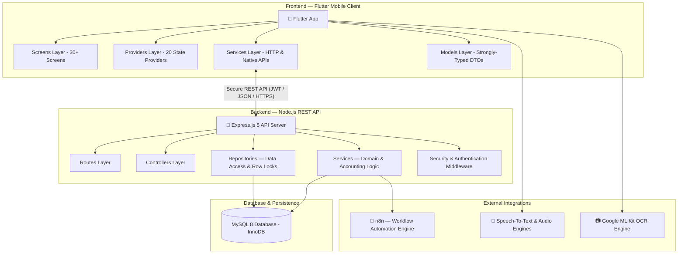
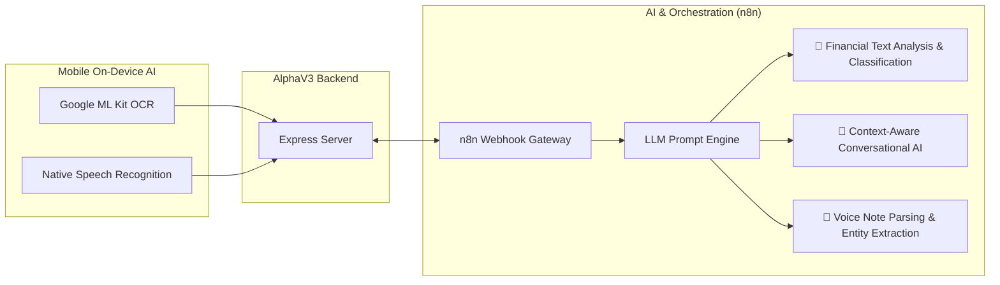
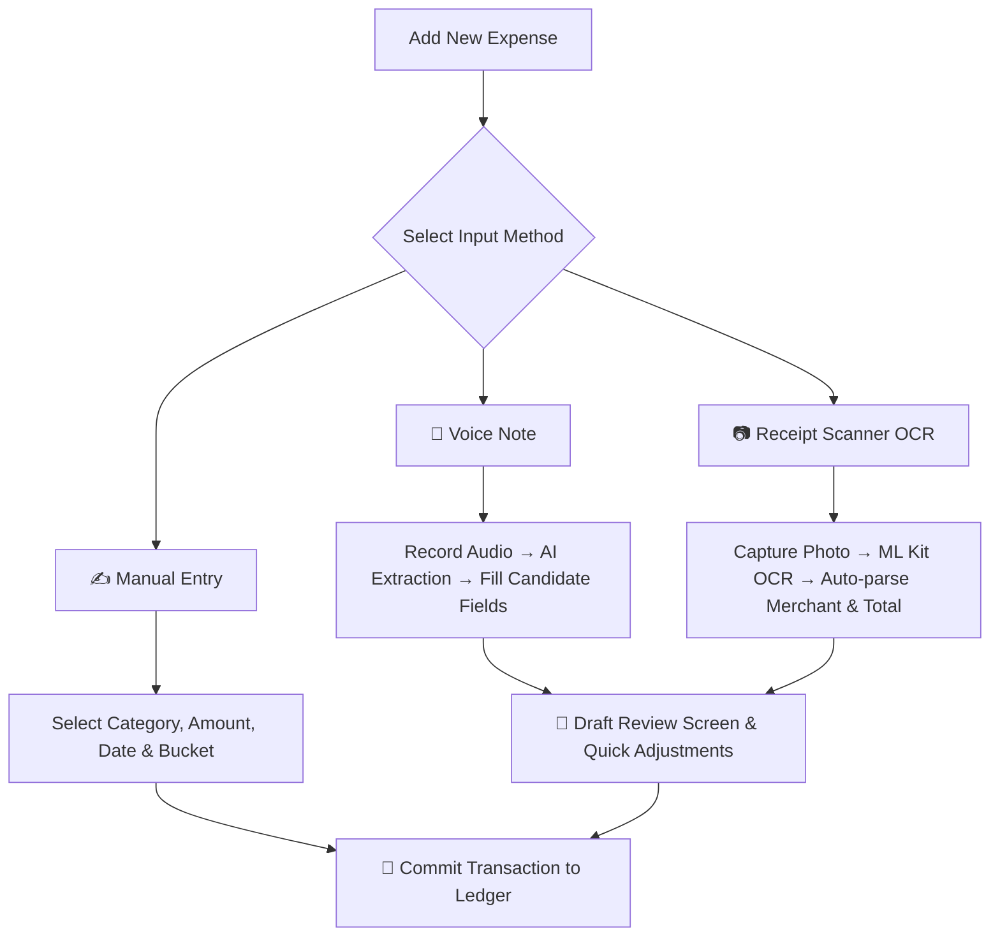
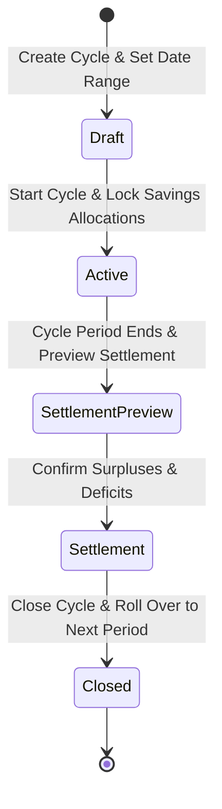
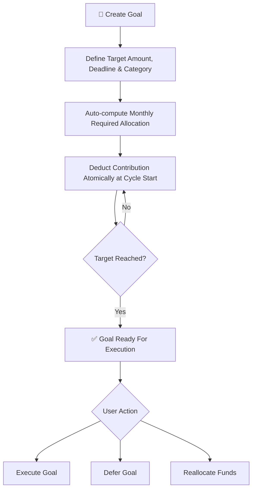
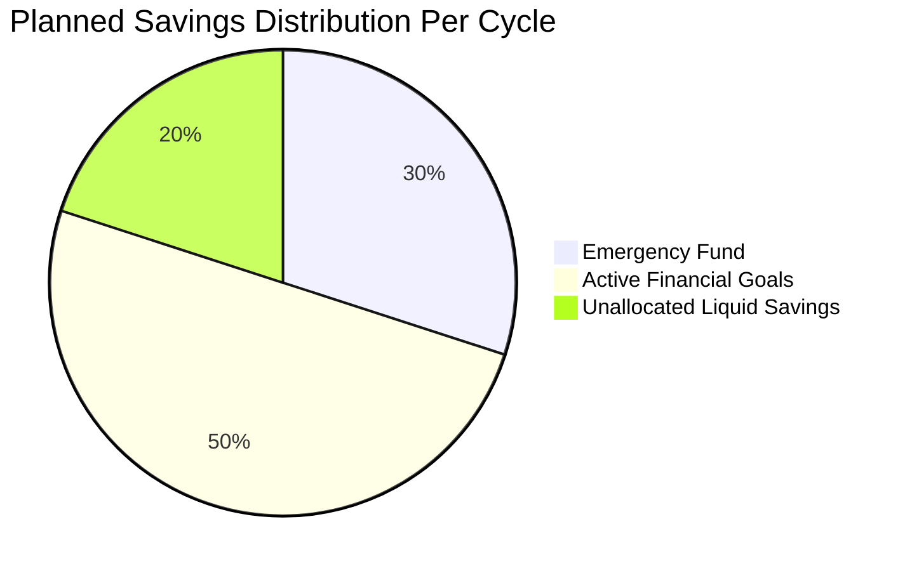
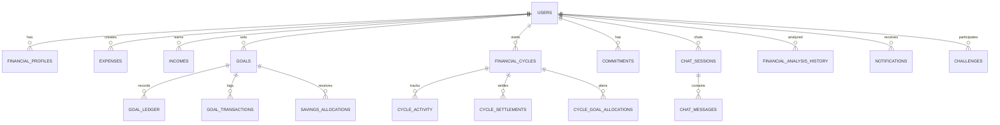
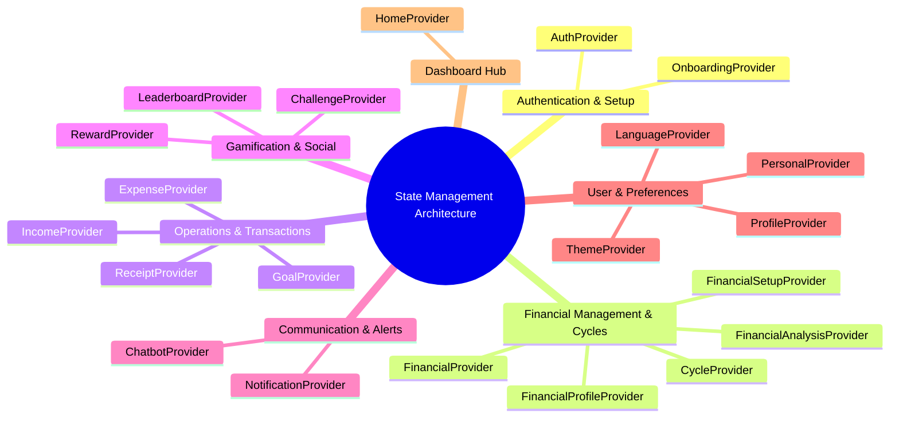

# AlphaV3 🚀 — Smart AI-Powered Personal Finance & Budgeting Ecosystem

<div align="center">

[](https://flutter.dev)
[](https://dart.dev)
[](https://nodejs.org)
[](https://expressjs.com)
[](https://www.mysql.com)
[](https://n8n.io)
[](https://vitest.dev)
[](#)

**A next-generation financial management platform combining automated cycle budgeting, concurrency-safe atomic ledgers, intelligent on-device receipt OCR, and interactive multi-modal AI voice & chat assistance.**

[Overview](#-1-project-overview) • [Architecture](#-2-technical-architecture) • [Key Features](#-3-detailed-features--capabilities) • [Database & Migrations](#-4-database-architecture--migrations) • [State Management](#-5-state-management-architecture) • [API Specs](#-6-api-architecture--endpoints) • [Competitive Advantages](#-7-competitive-advantages) • [Getting Started](#-8-installation--getting-started)

</div>

---

## 📌 1. Project Overview

**AlphaV3 (Alpha)** is an advanced, full-stack personal finance application engineered to empower users to take full control of their financial life. By combining modern budgeting methodologies (50/30/20 buckets, cycle-based planning, and emergency fund protection) with state-of-the-art AI capabilities (voice interaction, intelligent receipt OCR parsing via n8n pipelines, and real-time financial insights), AlphaV3 transforms chaotic personal spending into an automated, stress-free habit.

### 1.1 Problems Solved

| Common Financial Pain Point | AlphaV3 Solution |
|-----------------------------|-------------------|
| **Friction in recording daily expenses** | Instant multi-modal capture (Smart Voice input + Camera OCR + Manual quick entry) |
| **Lack of structured budget planning** | Automated monthly **Financial Cycles** and strict 3-bucket budgeting (Needs, Wants, Savings) |
| **Running out of money before month-end** | Dynamic **Safe Daily Spending (SDS)** metrics to meter safe discretionary spending |
| **Inability to maintain savings habits** | Automated savings allocation with dedicated **Emergency Fund** and **No Double-Counting** guarantees |
| **Lack of comprehensive financial clarity** | Central Financial Analysis Center with interactive charts, health scores, and personalized AI tips |
| **Boredom and loss of motivation** | Gamified savings challenges, badges, milestones, and competitive Leaderboard |

---

## 🏗️ 2. Technical Architecture

AlphaV3 follows a hardened **Client-Server Architecture** with a high-performance **RESTful API** backend and a reactive cross-platform mobile frontend.

### 2.1 System Architecture Diagram



### 2.2 External Integrations & AI Pipeline Workflow



---

## 🛠️ 3. Technology Stack

### 3.1 Mobile Frontend (Flutter)
| Technology | Version | Purpose |
|---|---|---|
| **Flutter SDK** | `>= 3.0.0` | Cross-platform UI toolkit (Android & iOS) |
| **Dart** | `>= 3.0.0` | Strongly-typed object-oriented client language |
| **Provider** | `^6.1.5` | Centralized reactive state management |
| **Easy Localization** | `^3.0.8` | Full internationalization (Arabic RTL & English LTR) |
| **Google Fonts** | `^8.2.0` | Custom typography supporting modern Mariam UI |
| **FL Chart** | `^1.2.0` | Interactive spending & savings charts |
| **Google ML Kit** | `^0.16.0` | On-device text recognition (Receipt OCR) |
| **Record & Just Audio** | `^7.1.1` / `^0.10.6` | Voice recording and dynamic audio playback |
| **Speech To Text** | `^7.4.0` | Real-time voice-to-text transcriptions |
| **Camera & Image Picker**| `^0.12.0` / `^1.2.3` | Receipt capturing and image selection |
| **Table Calendar** | `^3.2.0` | Interactive financial calendar & cycle timeline |

### 3.2 Backend API (Node.js)
| Technology | Version | Purpose |
|---|---|---|
| **Node.js** | `>= 18.x` | Scalable asynchronous JavaScript runtime |
| **Express.js** | `5.2.1` | Modern, high-throughput REST API framework |
| **MySQL 2** | `^3.23.1` | Relational database driver with ACID transactions |
| **JSONWebToken** | `^9.0.3` | Stateless token authentication |
| **Bcrypt** | `^6.0.0` | Cryptographic password hashing |
| **Helmet** | `^8.3.0` | HTTP security header protection |
| **Express Rate Limit** | `^8.6.0` | Brute-force & DDoS mitigation |
| **Express Validator** | `^7.3.2` | Robust request validation and payload sanitization |
| **Multer** | `^2.2.0` | Multi-part form handling for receipt images and audio |
| **Vitest & Supertest** | `^4.1.10` / `^7.2.2`| Automated unit & integration testing framework |

---

## ✨ 4. Detailed Features & Capabilities

### 4.1 Authentication & Multi-Stage Onboarding
- **Secure Credentials**: Phone number and password authentication backed by salted `bcrypt` hashing.
- **OTP Verification**: Multi-step verification and password reset flows with temporary tokens.
- **Financial Profile Setup**: Multi-tier onboarding wizard collecting initial income, fixed commitments, and target emergency fund percentages.
- **Financial Tier Classification**: Dynamic detection of user financial tier to customize recommendations.

### 4.2 Multi-Modal Expense Logging Engine



### 4.3 Financial Cycles & Settlement Architecture



- **50/30/20 Bucket Allocation**: Automatic categorization into **Needs**, **Wants**, and **Savings**.
- **Safe Daily Spending (SDS)**: Dynamically calculated daily allowances based on remaining active cycle days and unallocated discretionary budget.
- **Cycle Settlement**: Seamless month-end reconciliation reconciling actual spending against planned targets.

### 4.4 Financial Goals, Emergency Fund & Canonical Accounting



- **Permanent Ledger**: Every contribution, debit, and transfer is logged immutably in `goal_ledger`.
- **Row-Level Locking (`SELECT ... FOR UPDATE`)**: Eliminates race conditions during concurrent goal operations.
- **Canonical Savings Formula**:
  $$\text{Unallocated Savings} = \text{Planned Savings} - \text{Emergency Fund} - \sum \text{Goal Allocations}$$
- **Zero Double-Counting Guarantee**: Absolute mathematical separation between operational cycle funds, emergency reserves, and long-term goal allocations.



### 4.5 Intelligent AI Financial Assistant
- **Context-Aware Dialogue**: The assistant analyzes current user financial metrics (income, expenses, active goals, and cycle health) to deliver customized, actionable guidance.
- **n8n Workflow Pipelines**: External orchestration handles intent classification, multi-step prompt engineering, and structured responses.
- **Rate-Limiting Protection**: Guarded at 10 requests per minute to prevent abuse while ensuring high availability.

### 4.6 Gamification, Challenges & Social Insights
- **Habit-Building Challenges**: Daily, weekly, and monthly challenges (e.g., zero-spend days, cooking at home, savings sprints).
- **Rewards & Milestones**: Points system and achievement badges.
- **Leaderboard**: Friendly anonymized rankings to motivate healthy financial habits.
- **Celebration Delights**: In-app rating prompts and birthday celebration dialogs.

---

## 🗄️ 5. Database Architecture & Migrations

### 5.1 Entity Relationship Diagram (ERD)



### 5.2 Migration Log (26 Iterative Schema Migrations)

| Migration # | Name | Technical Purpose |
|:---:|---|---|
| **001-004** | `initial_schema_and_users` | Foundational database tables, user management, and base schema |
| **005** | `add_detected_tier_to_profiles` | Added financial tier classification to user profile schema |
| **006** | `convert_cents_to_jod` | Standardized decimal currency conventions to Jordanian Dinar (JOD) |
| **007** | `add_multi_input_support` | Multi-source input tracking (Manual, Voice, OCR) |
| **008** | `add_payment_method` | Extended expense payment methods (Cash, Card, Digital Wallet) |
| **009** | `phase1_goal_ledger` | Permanent audit ledger for financial goal contributions |
| **010** | `post_deployment_goal_ledger_fks`| Enforced foreign key constraints and referential integrity |
| **011** | `phase2_goal_planning` | Goal planning modes, preview APIs, and live calculation tables |
| **012** | `phase2c_savings_allocations` | Savings allocation tracking table |
| **013** | `add_personal_info_columns` | Extended profile metadata (Birth date, occupation, demographics) |
| **014** | `phase3a_financial_cycles` | Core table for managing user financial cycle lifecycles |
| **015** | `phase3a2_cycle_activity` | Real-time event log for cycle transactions and updates |
| **016** | `phase3a3_cycle_planning` | Planning schema for cycle bucket distribution |
| **017** | `phase3b_settlement` | Schema for cycle reconciliation, closing, and rollovers |
| **018** | `chat_ai_tables` | Persistent sessions and messages for AI chat interactions |
| **019** | `chat_indexes` | Performance indices for rapid conversational history retrieval |
| **020** | `reconcile_cycle_settlements` | Reconciliation constraints and data consistency fixes |
| **021** | `add_system_managed_goal_identity` | System-managed goals identity (Emergency Fund as managed goal) |
| **022** | `financial_analysis_history` | Historical archive for comprehensive financial health audits |
| **023** | `add_notifications` | User notification delivery and read status management |
| **024** | `challenges_system` | Gamification tables (challenges, user participations, points) |
| **025** | `fix_challenge_constraints` | Refined challenge participation uniqueness constraints |
| **026** | `canonical_savings_accounting` | Canonical savings accounting enforcing zero double-counting |

---

## 🧭 6. State Management Architecture

The mobile application utilizes **20 specialized Providers** to enforce separation of concerns, rapid UI redraws, and predictable reactive state flows:



---

## 🌐 7. API Architecture & Endpoints

| Resource Domain | Base Path | Endpoints | Core Responsibility |
|---|---|:---:|---|
| **Authentication** | `/api/v1/auth` | 5 | Signup, signin, OTP verification, password reset |
| **Onboarding** | `/api/v1/onboarding` | 4 | Initial financial questionnaire and tier determination |
| **Finance** | `/api/v1/` | 25+ | Incomes, expenses, commitments, goals, and profiles |
| **Cycles** | `/api/v1/financial-cycles` | 8 | Cycle creation, activation, settlement preview, closing |
| **Dashboard** | `/api/v1/dashboard` | 2 | Aggregated cycle overview and real-time dashboard data |
| **Receipt OCR** | `/api/v1/receipts` | 2 | Multi-part image upload, OCR processing, draft reconciliation |
| **Voice Processing**| `/api/v1/voice` | 1 | Audio note analysis and financial entity extraction |
| **AI Assistant** | `/api/v1/chat` | 1 | Context-rich conversational AI gateway |
| **Analysis** | `/api/v1/financial-analysis` | 2 | Deep financial evaluation reports and historical reviews |
| **Notifications** | `/api/v1/notifications` | 3 | In-app alerts, cycle deadline warnings, budget triggers |
| **Challenges** | `/api/v1/challenges` | 4 | Challenges lifecycle, claimable rewards, and leaderboard |

---

## 🏆 8. Competitive Advantages

| Feature / Capability | AlphaV3 | Standard Finance Apps |
|---|:---:|:---:|
| **AI-Powered Smart Voice Logging** | ✅ Fully integrated (auto-extracts entity & amount) | ❌ Rarely available |
| **On-Device Receipt OCR Scanner** | ✅ Google ML Kit + smart entity normalization | ⚠️ Limited / Paid add-on |
| **Context-Aware Financial Assistant** | ✅ Understands real-time balances, cycles & goals | ⚠️ Generic chatbots only |
| **Custom Financial Cycles (Flexible Paydays)** | ✅ Aligns with true salary cycles | ❌ Strict Gregorian month only |
| **Automated Goal & Emergency Fund Allocation** | ✅ Atomic ledger deductions per cycle | ⚠️ Manual tracking only |
| **Zero Double-Counting Guarantee** | ✅ Mathematical separation with row locks | ❌ Overlapping liquid balances |
| **Dedicated Arab & Jordanian Market Support** | ✅ Native JOD currency & flawless RTL | ⚠️ Partial translations |
| **Gamified Challenges & Leaderboard** | ✅ Interactive challenges, points & rankings | ⚠️ Dull, static charts |

---

## 📊 9. Codebase Statistics & Structure

```plaintext
alphav3-mariam-ui/
├── backend/
│   ├── src/services/       # 20 services managing all business domain logic (~240 KB)
│   ├── src/controllers/    # 14 route controllers (~38 KB)
│   ├── src/routes/         # 13 Express route definitions (~18 KB)
│   ├── src/database/       # 26 SQL migrations & seeds (~100 KB)
│   └── src/tests/          # Comprehensive Vitest unit & integration test suites
│
└── flutter/
    ├── lib/screens/        # 30+ production screens (~750 KB)
    ├── lib/providers/      # 20 state providers (~165 KB)
    ├── lib/services/       # 11 native hardware & HTTP client services (~45 KB)
    ├── lib/models/         # 18 strongly-typed data models (~55 KB)
    ├── lib/widgets/        # Modular UI widgets and design system (~50 KB)
    └── assets/             # Full Arabic / English localization files & image assets
```

---

## 🚀 10. Installation & Getting Started

### Prerequisites
- **Node.js** `>= 18.x`
- **MySQL** `>= 8.0`
- **Flutter SDK** `>= 3.0.0`
- **Git**

---

### Step 1: Backend Setup

1. **Clone the repository and enter backend directory**:
   ```bash
   git clone https://github.com/mohammadbzoor/alphav3.git
   cd alphav3/backend
   ```

2. **Install dependencies**:
   ```bash
   npm install
   ```

3. **Configure Environment Variables**:
   Copy `.env.example` to `.env`:
   ```bash
   cp .env.example .env
   ```
   Set your MySQL credentials, JWT secret, and n8n webhook URL:
   ```env
   PORT=3000
   DB_HOST=localhost
   DB_USER=root
   DB_PASSWORD=your_password
   DB_NAME=alpha
   JWT_SECRET=your_super_secret_jwt_key
   N8N_WEBHOOK_URL=https://your-n8n-instance/webhook/...
   ```

4. **Run Database Migrations**:
   ```bash
   node migrate.js
   ```

5. **Start Development Server**:
   ```bash
   npm run dev
   ```
   The backend API will be live at `http://localhost:3000`.

---

### Step 2: Flutter Client Setup

1. **Navigate to the Flutter project**:
   ```bash
   cd ../flutter
   ```

2. **Fetch dependencies**:
   ```bash
   flutter pub get
   ```

3. **Configure API Endpoint**:
   Inspect [api_config.dart](flutter/lib/config/api_config.dart) to toggle between:
   - `AppEnvironment.local` (e.g. `http://10.0.2.2:3000` for Android Emulator or your local LAN IP)
   - `AppEnvironment.production` (Cloud Render endpoint)

4. **Run on Device or Emulator**:
   ```bash
   flutter run
   ```

---

### Step 3: Running Tests

The backend test suite verifies concurrency safety, zero double-counting, and API controllers:
```bash
cd backend
npm run test
```

---

## 🗺️ 11. Future Roadmap

- [ ] **Phase 2B Implementation**: Execution of goal purchases, capital expense tracking, and dynamic fund reallocation.
- [ ] **Push Notifications**: Automated mobile alerts via Firebase Cloud Messaging (FCM).
- [ ] **PDF Financial Reports**: Export periodic financial health audits and tax receipts to PDF.
- [ ] **Open Banking API Integration**: Direct read-only synchronization with regional bank accounts and digital wallets.

---

## 📄 License & Authors

Developed and maintained by **Mohammad Al Bzoor** and contributors.  
All rights reserved © 2026.