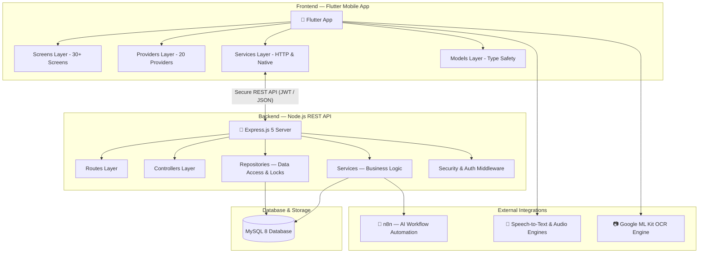
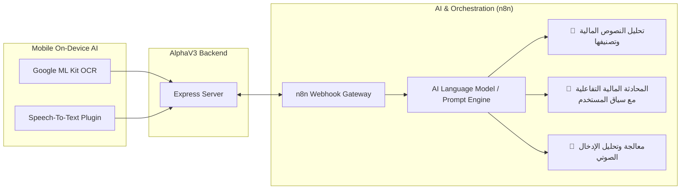
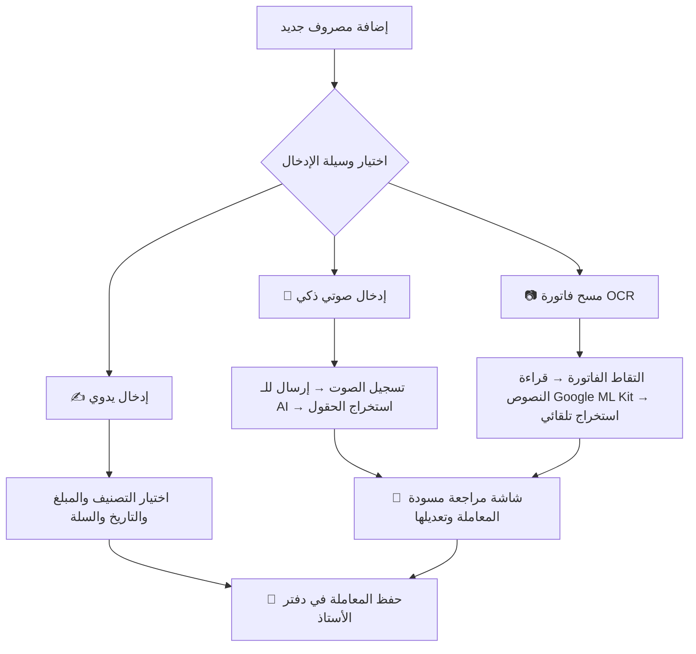
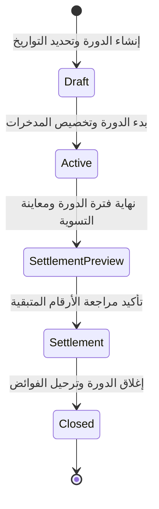
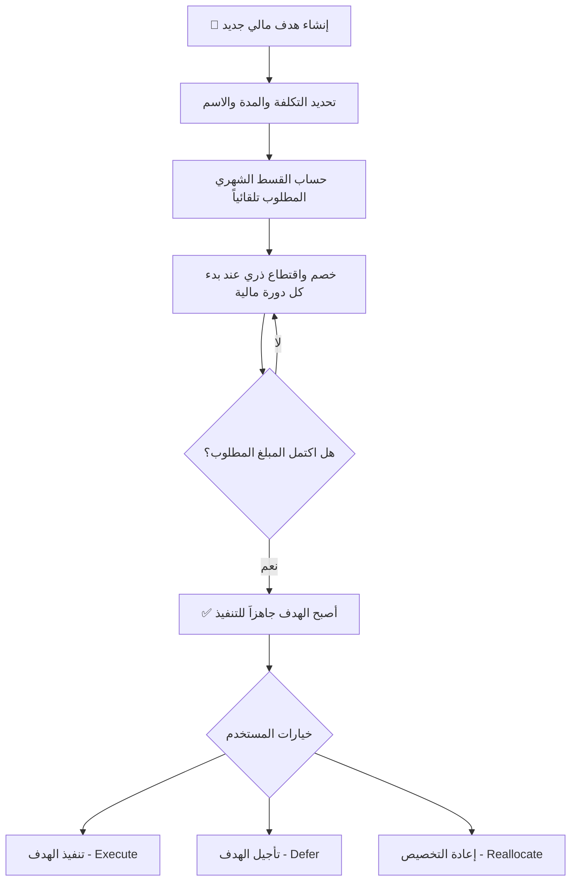
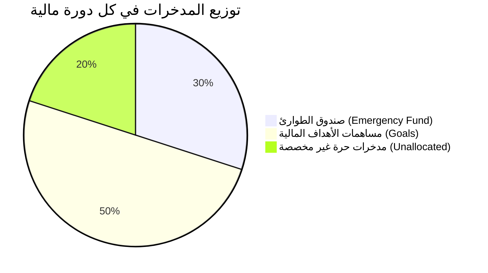
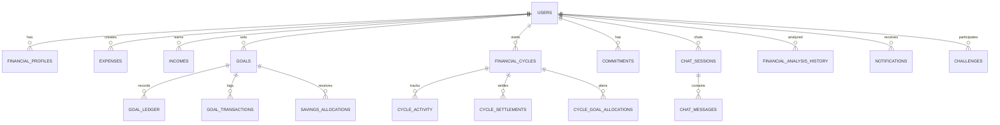
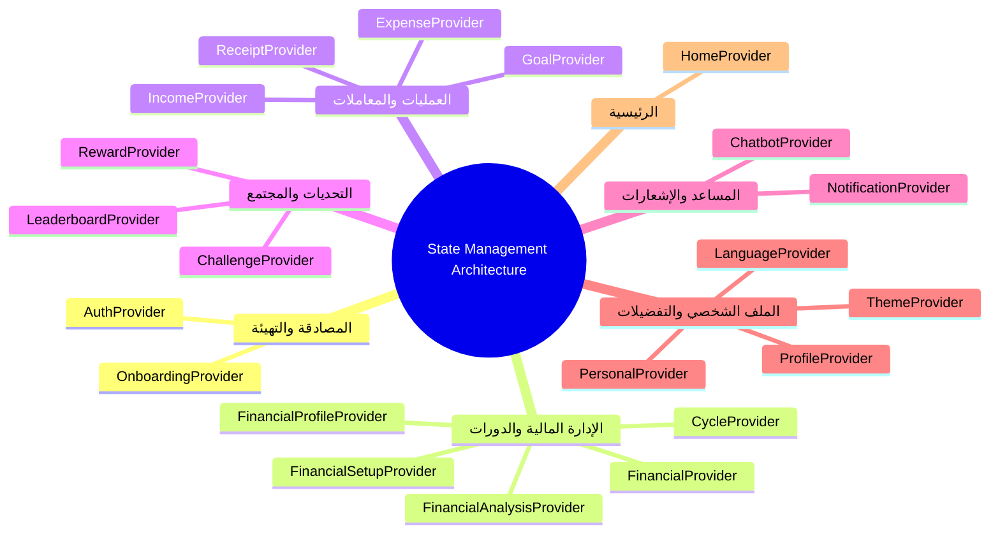

# AlphaV3 (ألفا) 🚀 — المنصة الذكية للإدارة المالية الشخصية
### Smart AI-Powered Personal Finance & Budgeting Platform

<div align="center">

[](https://flutter.dev)
[](https://dart.dev)
[](https://nodejs.org)
[](https://expressjs.com)
[](https://www.mysql.com)
[](https://n8n.io)
[](https://vitest.dev)
[](#)

**نظام بيئي مالي متكامل يجمع بين المحاسبة الدقيقة للدورات المالية، الأقفال التزامنية الآمنة، المسح الذكي للفواتير (OCR)، والمساعد الصوتي والنصي المدعوم بالذكاء الاصطناعي.**

[نظرة عامة](#-1-نظرة-عامة-على-المشروع) • [البنية التقنية](#-2-البنية-التقنية-technical-architecture) • [الميزات التفصيلية](#-3-الميزات-والوظائف-التفصيلية) • [هيكل قاعدة البيانات](#-4-هيكل-قاعدة-البيانات-والمايجريشنز) • [إدارة الحالة](#-5-إدارة-الحالة-state-management) • [المزايا التنافسية](#-6-المزايا-التنافسية) • [دليل التشغيل](#-7-دليل-التشغيل-والتثبيت)

</div>

---

## 📌 1. نظرة عامة على المشروع

**AlphaV3 (ألفا)** هو تطبيق متقدم لإدارة الشؤون المالية الشخصية، مصمم لتمكين المستخدمين (خاصة في السوق الأردني والعربي) من فرض السيطرة الكاملة على ميزانياتهم، التغلب على عشوائية الصرف، وبناء عادات ادخار مستدامة عبر أدوات أتمتة وذكاء اصطناعي تفاعلية.

### 1.1 المشاكل التي يعالجها المشروع

| التحدي المالي الشائع | الحل المبتكر في AlphaV3 |
|----------------------|--------------------------|
| **صعوبة تسجيل المصاريف يدوياً** | إدخال فوري متعدد الوسائط (صوت ذكي + مسح فواتير بالكاميرا OCR + إدخال يدوي) |
| **غياب خطة ميزانية واضحة** | نظام الدورات المالية الشهرية (Cycles) وتقسيم الميزانية لـ 3 سلال (احتياجات، رغبات، مدخرات) |
| **تبخر الرواتب قبل نهاية الشهر** | مؤشر الصرف اليومي الآمن (**Safe Daily Spending**) لتوزيع المصروف على أيام الدورة |
| **العجز عن الالتزام بالادخار** | تخصيص مالي تلقائي وصارم وصندوق طوارئ محمي بمبدأ محاسبي يمنع الحساب المزدوج |
| **عدم فهم الوضع المالي العام** | مركز التحليل المالي الذكي مع تقارير ورسوم بيانية تفاعلية وتوصيات مستمرة |
| **الملل وفقدان الحافز المالي** | نظام تحديات ادخار تفاعلي، نقاط ومكافآت، ولوحة متصدرين (Leaderboard) |

---

## 🏗️ 2. البنية التقنية (Technical Architecture)

يعتمد المشروع على معمارية العميل والخادم (**Client-Server Architecture**) عبر واجهات **RESTful API** فائقة الأمان والسرعة.

### 2.1 مخطط المعمارية العام



### 2.2 منظومة الخدمات الخارجية وسير عمل الذكاء الاصطناعي



### 2.3 حزمة التقنيات المستخدمة

#### تطبيق الموبايل (Flutter Client)
- **Flutter SDK** `>= 3.0.0` & **Dart** `>= 3.0.0`
- **إدارة الحالة**: `provider: ^6.1.5`
- **التدويل واللغات**: `easy_localization: ^3.0.8` (عربي RTL وإنجليزي LTR كامل)
- **الرسوم البيانية والتحليلات**: `fl_chart: ^1.2.0`
- **الذكاء الاصطناعي على الجهاز (OCR)**: `google_mlkit_text_recognition: ^0.16.0`
- **التعامل مع الصوت**: `speech_to_text: ^7.4.0` و `record: ^7.1.1` و `just_audio: ^0.10.6`
- **التقويم والتاريخ**: `table_calendar: ^3.2.0`
- **الكاميرا والصور**: `camera: ^0.12.0` و `image_picker: ^1.2.3`
- **الخطوط والتصميم**: `google_fonts: ^8.2.0` بتصميم **Mariam UI** العصري

#### الخادم والواجهات الخلفية (Backend API)
- **Node.js** مع إطار العمل الحديث **Express.js** `5.2.1`
- **قاعدة البيانات**: **MySQL 8** عبر بروتوكول `mysql2: ^3.23.1` بـ Transactions صارمة
- **الأمان والمصادقة**: `jsonwebtoken: ^9.0.3` و `bcrypt: ^6.0.0` و `helmet: ^8.3.0`
- **الحماية من الهجمات**: `express-rate-limit: ^8.6.0` (حماية عامة + حماية خاصة للشات الذكي)
- **معالجة الملفات والمدخلات**: `multer: ^2.2.0` و `express-validator: ^7.3.2`
- **الاختبارات الآلية**: **Vitest** `^4.1.10` و **Supertest** `^7.2.2`

---

## ⚡ 3. الميزات والوظائف التفصيلية

### 3.1 نظام المصادقة والتسجيل (Authentication & OTP)
- تسجيل الدخول الآمن برقم الهاتف وكلمة المرور مع تشفير `bcrypt`.
- التحقق وتأكيد الحساب عبر رمز **OTP** مخصص.
- استعادة كلمة المرور وإعادة تعيينها بخطوات آمنة.
- توجيه المستخدم الجديد عبر مراحل **Onboarding** تفاعلية لبناء الملف المالي الأساسي.

### 3.2 إدخال المصاريف متعدد الوسائط (Multi-Modal Expense Engine)



### 3.3 الدورات المالية وحساب الميزانية (Financial Cycles & Settlement)



- **توزيع السلال 50/30/20**: تصنيف تلقائي للاحتياجات الأساسية، الرغبات، والمدخرات.
- **Safe Daily Spending (SDS)**: احتساب ذكي للإنفاق اليومي المسموح به لمنع العجز.
- **تسوية دقيقة للدورة (Cycle Settlement)**: معالجة شاملة للفائض أو العجز وترحيله بصورة موثوقة.

### 3.4 إدارة الأهداف وصندوق الطوارئ (Goals & Canonical Savings)



- **Permanent Ledger**: كل مساهمة في الهدف تُسجل كحركة مالية غير قابلة للتلاعب.
- **Row-Level Locking (`SELECT ... FOR UPDATE`)**: حماية تزامنية تمنع تعارض الحركات في البيئات متعددة الطلبات.
- **معادلة الادخار القانونية الصارمة**:
  $$\text{Unallocated Savings} = \text{Planned Savings} - \text{Emergency Fund} - \sum \text{Goal Allocations}$$
- **Zero Double-Counting**: ضمان عدم تكرار احتساب أموال الأهداف مع رصيد الدورة التشغيلي.



### 3.5 المساعد المالي الذكي (AI Financial Chat & Voice)
- **محادثة نصية وصوتية متخصصة**: إجابات مبنية على السياق المالي الفعلي للمستخدم (دخله، مصاريفه الحالية، أهدافه).
- **تكامل n8n Webhook**: معالجة مركزية للنوايا (Intent Detection) وتوليد التوصيات والتحليلات.
- **حماية المساعد**: تحديد معدل الرسائل (10 طلبات/دقيقة) لحماية الموارد من الاستهلاك المفرط.

### 3.6 التحليلات والتحديات والتحفيز (Gamification & Insights)
- **مركز التحليلات المالية**: مخططات ورسوم بيانية تفاعلية (`fl_chart`)، قياس معدل الادخار، وتتبع تغير السلوك المالي عبر الزمن.
- **نظام التحديات والمكافآت**: تحديات يومية وأسبوعية وشهرية مع نقاط وشارات تميز ولوحة المتصدرين (**Leaderboard**).
- **لمسات تفاعلية مميزة**: شاشة تقييم التجربة (**Rating Screen**) ونافذة تهنئة عيد الميلاد للمستخدم (**Birthday Celebration Dialog**).

---

## 🗄️ 4. هيكل قاعدة البيانات والمايجريشنز

### 4.1 مخطط العلاقات الكيانية (ER Diagram)



### 4.2 سجل المايجريشنز التفصيلي (26 Migration)

| رقم | اسم المايجريشن | الوظيفة التقنية |
|:---:|----------------|-----------------|
| **001-004** | `initial_schema_and_users` | إنشاء الجداول التأسيسية، المستخدمين والمصاريف |
| **005** | `add_detected_tier_to_profiles` | تصنيف المستوى المالي للمستخدم تلقائياً |
| **006** | `convert_cents_to_jod` | توحيد والتحويل الدقيق للمبالغ بالدينار الأردني (JOD) |
| **007** | `add_multi_input_support` | دعم مصادر إدخال متعددة (Manual, Voice, OCR) |
| **008** | `add_payment_method` | تتبع وسيلة الدفع (نقدي، بطاقة، محفظة) |
| **009** | `phase1_goal_ledger` | إنشاء دفتر الأستاذ الدائم للأهداف المالية |
| **010** | `post_deployment_goal_ledger_fks` | تعزيز قيود المفاتيح الأجنبية وسلامة البيانات |
| **011** | `phase2_goal_planning` | دعم أوضاع التخطيط ومعاينة الأهداف المسبقة |
| **012** | `phase2c_savings_allocations` | جدول توزيع واقتطاع المدخرات |
| **013** | `add_personal_info_columns` | بيانات الملف الشخصي الإضافية وتاريخ الميلاد |
| **014** | `phase3a_financial_cycles` | تأسيس جدول الدورات المالية وحالاتها |
| **015** | `phase3a2_cycle_activity` | تتبع النشاط المالي لكل دورة |
| **016** | `phase3a3_cycle_planning` | تخطيط مخصصات ومصروفات الدورة |
| **017** | `phase3b_settlement` | تسوية الدورة المالية وإغلاقها |
| **018** | `chat_ai_tables` | جداول جلسات ورسائل المساعد الذكي |
| **019** | `chat_indexes` | تحسين سرعة وفهارس استرجاع محادثات الـ AI |
| **020** | `reconcile_cycle_settlements` | مطابقة وإعادة مواءمة بيانات التسوية |
| **021** | `add_system_managed_goal_identity` | هوية الأهداف التلقائية وصندوق الطوارئ |
| **022** | `financial_analysis_history` | أرشفة تقارير التحليل المالي السابقة |
| **023** | `add_notifications` | إدارة الإشعارات والتنبيهات |
| **024** | `challenges_system` | جداول نظام التحديات والنقاط والمكافآت |
| **025** | `fix_challenge_constraints` | تعديل وتحسين قيود التحديات |
| **026** | `canonical_savings_accounting` | اعتماد المحاسبة القانونية الصارمة للمدخرات ومنع الازدواجية |

---

## 🧭 5. إدارة الحالة (State Management)

يعتمد التطبيق على معمارية **20 موفر حالة (Provider)** متخصصة لضمان فصل الاهتمامات وسرعة استجابة الشاشات:



---

## 🌐 6. هيكل الـ API والأمان

| الوحدة البرمجية | المسار الرئيسي | عدد الـ Endpoints | الوظيفة |
|-----------------|----------------|:-----------------:|---------|
| **Auth** | `/api/v1/auth` | 5 | تسجيل، دخول، تحقق OTP، واستعادة كلمة المرور |
| **Onboarding** | `/api/v1/onboarding` | 4 | الإعداد المالي الأولي وتحديد المستويات |
| **Finance** | `/api/v1/` | 25+ | المصاريف، الدخل، الأهداف، الالتزامات، والملف المالي |
| **Cycles** | `/api/v1/financial-cycles` | 8 | إنشاء وبدء وتسوية وإغلاق الدورات المالية |
| **Dashboard** | `/api/v1/dashboard` | 2 | جلب بيانات لوحة التحكم الشاملة |
| **Receipts** | `/api/v1/receipts` | 2 | رفع ومعالجة الفواتير ومطابقة المسودات |
| **Voice** | `/api/v1/voice` | 1 | استقبال التسجيل الصوتي وتحليله |
| **AI Chat** | `/api/v1/chat` | 1 | المحادثة مع الذكاء الاصطناعي مع كامل السياق المالي |
| **Analysis** | `/api/v1/financial-analysis` | 2 | توليد وجلب تقارير التحليل المالي |
| **Notifications** | `/api/v1/notifications` | 3 | إدارة التنبيهات والإشعارات |
| **Challenges** | `/api/v1/challenges` | 4 | التحديات والجوائز ولوحة المتصدرين |

---

## 🏆 7. المزايا التنافسية

| الميزة | AlphaV3 (ألفا) | التطبيقات المالية الأخرى |
|--------|:-------------:|:------------------------:|
| **إدخال صوتي ذكي بالذكاء الاصطناعي** | ✅ نعم (تحليل دقيق واستخراج تلقائي) | ❌ غير متوفر غالباً |
| **مسح الفواتير بالـ OCR محلياً وسحابياً** | ✅ Google ML Kit + تطبيع تلقائي | ⚠️ محدود جداً أو مدفوع |
| **مساعد مالي ذكي يعرف أرقامك الحقيقية** | ✅ سياق مالي متكامل عبر n8n | ⚠️ روبوتات أسئلة عامة فقط |
| **نظام ميزانية بالدورات الشهرية الحقيقية** | ✅ يدعم تواريخ الراتب المتغيرة | ❌ تقويم شهري ميلادي جامد |
| **تخصيص آلي للأهداف وصندوق الطوارئ** | ✅ اقتطاع ذري بدفتر أستاذ دائم | ⚠️ تتبع يدوي فقط |
| **منع الازدواجية المالية (No Double Counting)** | ✅ معادلة محاسبية صارمة بقفل تزامني | ❌ تداخل في حساب الرصيد الحر |
| **دعم حقيقي للسوق المحلي والعربي** | ✅ دعم كامل للدينار الأردني و RTL | ⚠️ عملات أجنبية وواجهات معربة جزئياً |
| **نظام تحديات ومكافآت محفز** | ✅ Gamification كامل مع لوحة متصدرين | ⚠️ جداول وأرقام جافة |

---

## 📦 8. إحصائيات المشروع وحجم الكود

```plaintext
alphav3-mariam-ui/
├── backend/
│   ├── src/services/       # 20 خدمة تغطي كافة المنطق المحاسبي (~240 KB)
│   ├── src/controllers/    # 14 متحكم للطلبات (~38 KB)
│   ├── src/routes/         # 13 مسار للـ Endpoints (~18 KB)
│   ├── src/database/       # 26 مايجريشن (~100 KB)
│   └── src/tests/          # اختبارات شاملة مع Vitest
│
└── flutter/
    ├── lib/screens/        # 30+ شاشة متكاملة (~750 KB)
    ├── lib/providers/      # 20 Provider لإدارة الحالة (~165 KB)
    ├── lib/services/       # 11 خدمة للشبكة والعتاد (~45 KB)
    ├── lib/models/         # 18 نموذج للبيانات (~55 KB)
    ├── lib/widgets/        # عناصر واجهة مخصصة وقابلة لإعادة الاستخدام (~50 KB)
    └── assets/             # ترجمات ar/en كاملة وصور وأيقونات
```

---

## 🚀 9. دليل التشغيل والتثبيت (Getting Started)

### المتطلبات الأساسية
- **Node.js** `>= 18.x`
- **MySQL** `>= 8.0`
- **Flutter SDK** `>= 3.0.0`

---

### أولاً: إعداد وتشغيل الخادم (Backend)

1. الانتقال إلى مجلد الخادم:
   ```bash
   cd backend
   ```
2. تثبيت الحزم والمكتبات:
   ```bash
   npm install
   ```
3. إعداد المتغيرات البيئية:
   نسخ `.env.example` إلى `.env` وضبط بيانات الاتصال:
   ```env
   PORT=3000
   DB_HOST=localhost
   DB_USER=root
   DB_PASSWORD=your_password
   DB_NAME=alpha
   JWT_SECRET=your_jwt_secret_key
   N8N_WEBHOOK_URL=https://your-n8n-instance/webhook/...
   ```
4. تشغيل المايجريشنز لإنشاء الجداول:
   ```bash
   node migrate.js
   ```
5. بدء تشغيل الخادم:
   ```bash
   npm run dev
   ```

---

### ثانياً: إعداد وتشغيل تطبيق الموبايل (Flutter)

1. الانتقال إلى مجلد التطبيق:
   ```bash
   cd flutter
   ```
2. تحميل الحزم والاعتماديات:
   ```bash
   flutter pub get
   ```
3. ضبط رابط الخادم:
   - للتشغيل المحلي، تأكد من عنوان الـ IP في [api_config.dart](flutter/lib/config/api_config.dart).
4. تشغيل التطبيق على جهاز أو محاكي:
   ```bash
   flutter run
   ```

---

### ثالثاً: تشغيل الاختبارات الآلية (Testing)

يحتوي الخادم على اختبارات تكاملية ووحدية شاملة:
```bash
cd backend
npm run test
```

---

## 🗺️ 10. خطة التطوير القادمة (Roadmap)

- [ ] **Phase 2B**: تنفيذ وتأكيد الأهداف المالية والمصاريف الرأسمالية وإعادة التخصيص الديناميكي.
- [ ] **Push Notifications**: تفعيل إشعارات الدفع عبر Firebase Cloud Messaging.
- [ ] **PDF Financial Reports**: تصدير كشوفات وتقارير مالية دورية بصيغة PDF.
- [ ] **Open Banking Integration**: ربط وتتبع آلي مع الحسابات والمحافظ البنكية المحلية.

---

## 📄 الترخيص وفريق العمل (Authors & License)

- **تطوير وإشراف**: محمد البزور (Mohammad Al Bzoor) وفريق العمل.
- جميع الحقوق محفوظة © 2026.